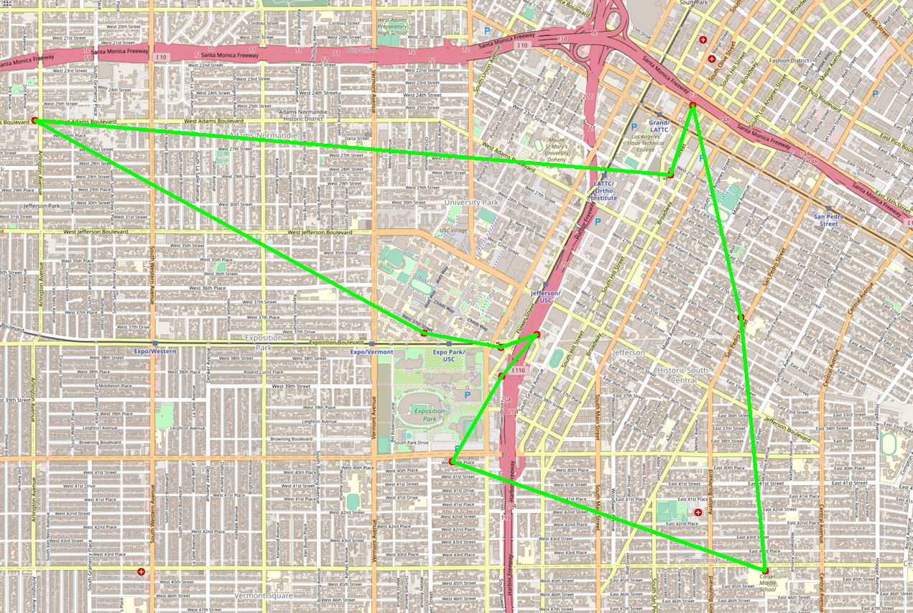
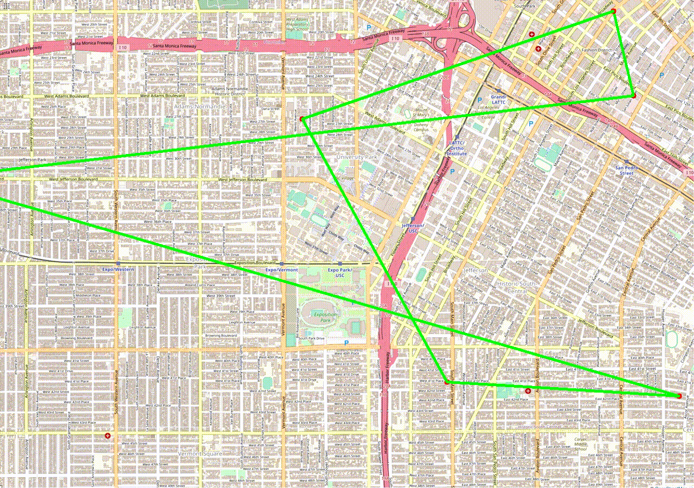
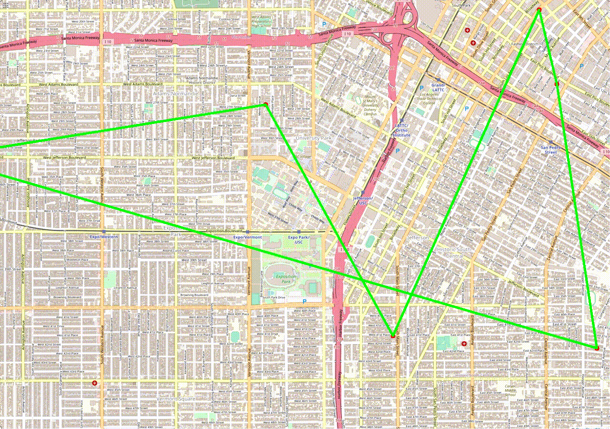
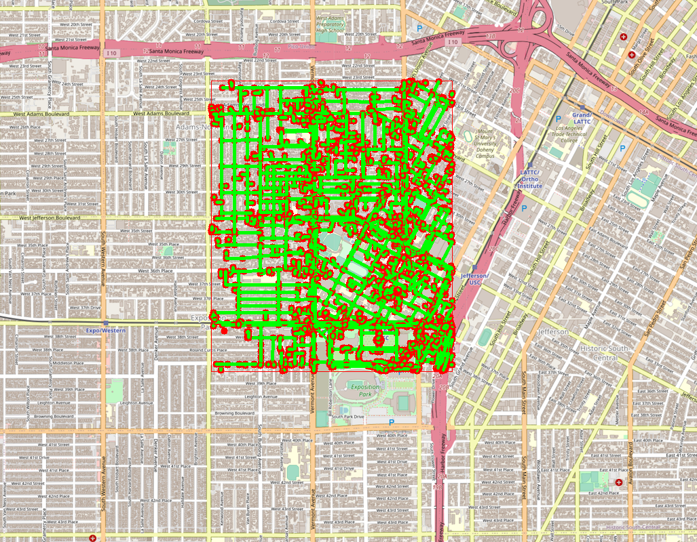
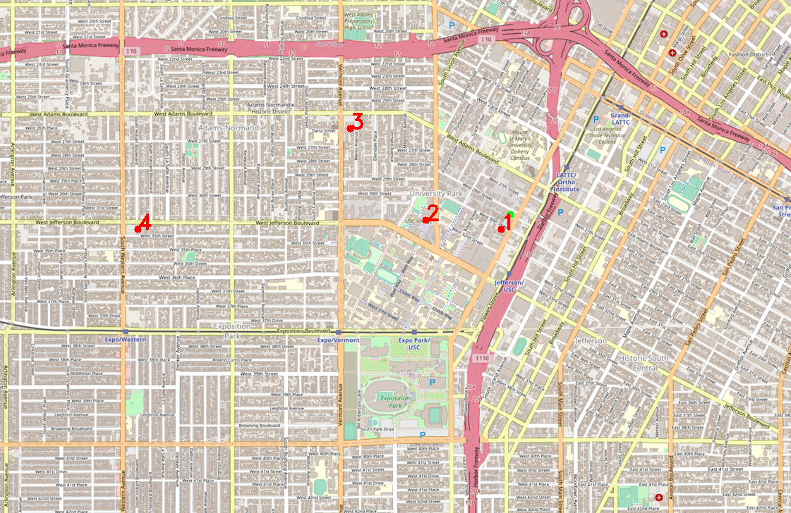

# EE538 Final Project Report - Spring 2022 - TrojanMap

## TrojanMap

This project focuses on using data structures in C++ and implementing various graph algorithms to build a map application.

<p align="center"></p>

- Please clone the repository, look through [README.md](README.md) and fill up functions to finish in the project.
- Please make sure that your code can run `bazel run/test`.
- In this project, you will need to fill up [trojanmap.cc](src/lib/trojanmap.cc) and add unit tests in the `tests` directory.

---

## The data Structure

Each point on the map is represented by the class **Node** shown below and defined in [trojanmap.h](src/lib/trojanmap.h).

```cpp
class Node {
  public:
    Node(){};
    Node(const Node &n){id = n.id; lat = n.lat; lon = n.lon; name = n.name; neighbors = n.neighbors; attributes = n.attributes;};
    std::string id;    // A unique id assign to each point
    double lat;        // Latitude
    double lon;        // Longitude
    std::string name;  // Name of the location. E.g. "Bank of America".
    std::vector<std::string> neighbors;  // List of the ids of all neighbor points.
    std::unordered_set<std::string> attributes;  // List of the attributes of the location.
};
```
---

## Demonstration
## 1. Autocomplete the location name

```c++
std::vector<std::string> Autocomplete(std::string name);
```

### Description

We consider the names of nodes as the locations. Implement a method to type the partial name of the location and return a list of possible locations with partial name as prefix. Please treat uppercase and lower case as the same character.

### Example

```shell
**************************************************************
* 1. Autocomplete                                             
**************************************************************

Please input a partial location:sh
*************************Results******************************
Shell
Shall Gas
**************************************************************
Time taken by function: 2 ms
```
### Time Complexity

Since we have to go over all of the nodes every time, the amortized time complexity is O(N), where N is the number of nodes.

### Run Time

2ms

## 2. GetPosition

```c++
std::pair<double, double> GetPosition(std::string name);
```

### Description

Given a location name, return the latitude and longitude. There are no duplicated location names. You should mark the given locations on the map. If the location does not exist, return (-1, -1). The algorithm is case-sensitive.

### Example

```shell
**************************************************************
* 2. Find the position                                        
**************************************************************

Please input a location:KFC
*************************Results******************************
Latitude: 34.0261 Longitude: -118.278
**************************************************************
Time taken by function: 2 ms


Please input a location:chevr
*************************Results******************************
No matched locations.
Did you mean Chevron instead of chevr? [y/n]y
Latitude: 34.0107 Longitude: -118.282
**************************************************************
Time taken by function: 4 ms
```

<p align="center"></p>

### Time Complexity

We need to find the ID, so the time complexity is O(n)

### Run Time

2ms/4ms

## 3. CalculateShortestPath between two places

```c++
std::vector<std::string> CalculateShortestPath_Dijkstra(std::string &location1_name,
                                               std::string &location2_name);
std::vector<std::string> CalculateShortestPath_Bellman_Ford(std::string &location1_name,
                                               std::string &location2_name);
```

### Description

Given 2 locations A and B, find the best route from A to B. The distance between 2 points is the euclidean distance using latitude and longitude. You should use both Dijkstra algorithm and Bellman-Ford algorithm. Compare the time for the different methods. Show the routes on the map. If there is no path, please return empty vector.

### Example

```shell
**************************************************************
* 3. CalculateShortestPath                                    
**************************************************************

Please input the start location:New Orleans Fish Market
Please input the destination:Pico & Grand 1
*************************Dijkstra*****************************
*************************Results******************************
"4630604681","123217349","1474987714","4010228203","122728849","4630591199","4010228204","3285242850","1773954385","4010228205","3285243207","1773954325","4010228206","3285243192","6276831438","7863690488","122736914","2613066342","2613066349","122925430","703503233","6792460858","6792460859","6792460857","6792460860","6792460856","123184124","6276831442","123184122","2613066319","123584178","123287930","122891377","2613066253","123289580","122625071","123019362","123208573","123530460","7162324661","7162324670","7162324669","7162324675","7162324662","7162324668","7162324667","7162324666","7162324663","7162324665","7162324664","123076578","123192488","8796829402","123192486","2613066292","2613066266","2613066280","2613066252","6815190465","1732243541","6819162814","6819162819","6819162818","6819162822","6819162821","6819162820","2613066281","6789880439","122609825","6789880424","4020099332","6789880427","122609821","2613073721","4020099331","7257246592","4835558517","4020099330","5618016858","21098538","1855143727","1855143736","6814481788","1630940683","6814481787","1630951209","6814481791","1630951168","1855143757","1855143765","1855143762","1630951165","1855173116","123166179","1862312619","1836106814","123166178","1836106811","213431715","213431722","1836106812","1836105952","6693451972","213431728","932387853","1836106818","1836106817","1836119958","1836106815","213431754","213431767","5707881721","123166173","1472141010","932378167","932378195","932378196","1870800152","932378197","1870800153","1870800155","1870800154","932378219","6226313826","1837206580","7867091026","269635685","4020099354","269635717","269635684","1837206577","269635682","269635727","6805760713","6805760716","123280946","6805760719","6790392176","8201681436","1855120255","6820982886","269633021","6820972482","4872886234","7211629027","6815182444","544348508","441893821","123280934","441893924","544348522","4012864450","9596483787","9596483789","9596483788","9596483790","9596483791","7867127941","4012864451","1732340070","4012864452","6788102185","6817197847","6817197853","6813513567","6813513568","544348521","4147530482","122659031","4147530483","4012864453","123281095","5680945535","4012541084","6805477811","6807381246","9596483796","4012541085","1732340098","9596464347","4012541086","6816288735","1732340079","5680945546","4012541087","6816288746","1738419616","4012543489","8179059373","4012543491","3663661800","123281092","1866577817","17680180","72092127","3411951517","4011837242","3577173187","2611833624","122420467","123165387","4039976027","7278984140","60957905","3663661823","4040002632","122648660","9598396764","8395566137","123281089","7863423172","6805137655","6808035754","122704147","3663662931","69196947","5344542576","3402868024","9601938171",
The distance of the path is:4.80347 miles
**************************************************************
Time taken by function: 135 ms

*************************Bellman_Ford*************************
*************************Results******************************
"4630604681","123217349","1474987714","4010228203","122728849","4630591199","4010228204","3285242850","1773954385","4010228205","3285243207","1773954325","4010228206","3285243192","6276831438","7863690488","122736914","2613066342","2613066349","122925430","703503233","6792460858","6792460859","6792460857","6792460860","6792460856","123184124","6276831442","123184122","2613066319","123584178","123287930","122891377","2613066253","123289580","122625071","123019362","123208573","123530460","7162324661","7162324670","7162324669","7162324675","7162324662","7162324668","7162324667","7162324666","7162324663","7162324665","7162324664","123076578","123192488","8796829402","123192486","2613066292","2613066266","2613066280","2613066252","6815190465","1732243541","6819162814","6819162819","6819162818","6819162822","6819162821","6819162820","2613066281","6789880439","122609825","6789880424","4020099332","6789880427","122609821","2613073721","4020099331","7257246592","4835558517","4020099330","5618016858","21098538","1855143727","1855143736","6814481788","1630940683","6814481787","1630951209","6814481791","1630951168","1855143757","1855143765","1855143762","1630951165","1855173116","123166179","1862312619","1836106814","123166178","1836106811","213431715","213431722","1836106812","1836105952","6693451972","213431728","932387853","1836106818","1836106817","1836119958","1836106815","213431754","213431767","5707881721","123166173","1472141010","932378167","932378195","932378196","1870800152","932378197","1870800153","1870800155","1870800154","932378219","6226313826","1837206580","7867091026","269635685","4020099354","269635717","269635684","1837206577","269635682","269635727","6805760713","6805760716","123280946","6805760719","6790392176","8201681436","1855120255","6820982886","269633021","6820972482","4872886234","7211629027","6815182444","544348508","441893821","123280934","441893924","544348522","4012864450","9596483787","9596483789","9596483788","9596483790","9596483791","7867127941","4012864451","1732340070","4012864452","6788102185","6817197847","6817197853","6813513567","6813513568","544348521","4147530482","122659031","4147530483","4012864453","123281095","5680945535","4012541084","6805477811","6807381246","9596483796","4012541085","1732340098","9596464347","4012541086","6816288735","1732340079","5680945546","4012541087","6816288746","1738419616","4012543489","8179059373","4012543491","3663661800","123281092","1866577817","17680180","72092127","3411951517","4011837242","3577173187","2611833624","122420467","123165387","4039976027","7278984140","60957905","3663661823","4040002632","122648660","9598396764","8395566137","123281089","7863423172","6805137655","6808035754","122704147","3663662931","69196947","5344542576","3402868024","9601938171",
The distance of the path is:4.80347 miles
**************************************************************
Time taken by function: 11873 ms
```

<p align="center"></p>

### Time Complexity
Dijkstra with priority queue: O((m + n)logn)
Bellman Forth: O(mn)

### Run Time
Bellman-Ford takes 100 times more than Dijkstra.

## 4. The Travelling Trojan Problem (AKA Travelling Salesman!)

### Description
In this section, we assume that we are using a UAV which means we can fly directly from 1 point to another point. Given a vector of location ids, assume every location can reach all other locations in the vector (i.e. assume that the vector of location ids is a complete graph).
Find the shortest route that covers all the locations exactly once and goes back to the start point. 

We will use the following algorithms:

- Brute-force (i.e. generating all permutations, and returning the minimum)
```c++
std::pair<double, std::vector<std::vector<std::string>>> TravellingTrojan_Brute_force(
      std::vector<std::string> location_ids);
```
- Brute-force enhanced with early backtracking
```c++
std::pair<double, std::vector<std::vector<std::string>>> TravellingTrojan_Backtracking(
      std::vector<std::string> location_ids);
```
- [2-opt Heuristic]
```c++
std::pair<double, std::vector<std::vector<std::string>>> TravellingTrojan_2opt(
      std::vector<std::string> location_ids);
```
- [3-opt Heuristic]
```c++
std::pair<double, std::vector<std::vector<std::string>>> TravellingTrojan_3opt(
      std::vector<std::string> location_ids); 
```
### Example

```shell
**************************************************************
* 4. Travelling salesman problem                              
**************************************************************

In this task, we will select N random points on the map and you need to find the path to travel these points and back to the start point.

Please input the number of the places:10
"3663661811","6807440082","3396366693","6788057223","1855166144","4540761794","1614922624","348122198","7828138314","6816929748",
Calculating ...
*************************Results******************************
TravellingTrojan_Brute_force
"3663661811","7828138314","4540761794","348122198","1614922624","6788057223","1855166144","6807440082","6816929748","3396366693","3663661811",
The distance of the path is:9.82387 miles
**************************************************************
You could find your animation at src/lib/output0.avi.          
Time taken by function: 1220 ms

Calculating ...
*************************Results******************************
TravellingTrojan_Backtracking
"3663661811","7828138314","4540761794","348122198","1614922624","6788057223","1855166144","6807440082","6816929748","3396366693","3663661811",
The distance of the path is:9.82387 miles
**************************************************************
You could find your animation at src/lib/output0_backtracking.avi.
Time taken by function: 1198 ms

Calculating ...
*************************Results******************************
TravellingTrojan_2opt
"3663661811","3396366693","7828138314","4540761794","348122198","1614922624","6788057223","1855166144","6807440082","6816929748","3663661811",
The distance of the path is:9.99586 miles
**************************************************************
You could find your animation at src/lib/output0_2opt.avi.     
Time taken by function: 3 ms
```
Shortest TSP path:

<p align="center"></p>

Brute Force:

<p align="center"></p>

Early Backtracking

<p align="center"></p>

2-opt

<p align="center"></p>

### Time Complexity

Brute Force: O(n!)  
Early Backtracking: O(n!)  
2-opt: O(n^2)  
3-opt: O(n^3)  

### Run Time

1.num of locations = 10  
Brute Force: t = 1220ms, dist = 9.82387        
Early Backtracking: t = 1198ms, dist = 9.82387  
2-opt: t = 3ms, dist = 9.99586  
ratio p = 9.99586/9.82387 = 1.02  

2.num of locations = 11  
Brute Force: t = 13219ms, dist = 9.15577      
Early Backtracking: t = 13014ms, dist = 9.1577  
2-opt: t = 4ms, dist = 10.2935  
ratio p = 10.2935/9.1577 = 1.12  

3.num of locations = 12  
Brute Force: t = 162274ms, dist = 6.33796   
Early Backtracking: t = 160877ms, dist = 6.33796  
2-opt: t = 10ms, dist = 7.33576  
ratio p = 7.33576/6.33796 = 1.16  

## 5. Cycle Detection

```c++
bool CycleDetection(std::vector<double> &square);
```

### Description

In this section, we use a square-shaped subgraph of the original graph by using four coordinates stored in ```std::vector<double> square```, which follows the order of left, right, upper, and lower bounds. 

Then try to determine if there is a cycle path in the that subgraph. If it does, return true and report that path on the map. Otherwise return false.

### Example

<p align="center"></p>

```shell
**************************************************************
* 5. Cycle Detection                                          
**************************************************************

Please input the left bound longitude(between -118.320 and -118.250):-118.300
Please input the right bound longitude(between -118.320 and -118.250):-118.280
Please input the upper bound latitude(between 34.000 and 34.040):34.035
Please input the lower bound latitude(between 34.000 and 34.040):34.015
*************************Results******************************
there exists a cycle in the subgraph 
**************************************************************
Time taken by function: 2 ms
```
### Time Complexity

We use DFS to detect a cycle in a graph, so the run time complexity is O(V+E)

### Run Time

2ms

## 6. Topological Sort

```c++
std::vector<std::string> DeliveringTrojan(std::vector<std::string> &location_names,
                                            std::vector<std::vector<std::string>> &dependencies);
```

### Description

In this section, we assume that we are using a UAV which means we can fly directly from 1 point to another point. Tommy Trojan got a part-time job from TrojanEats, for which he needs to pick up and deliver food from local restaurants to various location near the campus. Tommy needs to visit a few different location near the campus with certain order, since there are some constraints. For example, he must first get the food from the restaurant before arriving at the delivery point. 

The TrojanEats app will have some instructions about these constraints. So, Tommy asks you to help him figure out the feasible route!

### Example

location_names = {"Pico & Grand 1","Parkside Dining Hall","Leavey Library","Adams Fuel","New Orleans Fish Market"}
dependencies = {{"Parkside Dining Hall","Leavey Library"}, {"Pico & Grand 1","New Orleans Fish Market"}, {"Leavey Library","Adams Fuel"}}

```shell
**************************************************************
* 6. Topological Sort                                         
**************************************************************

Please input the locations filename:/Users/Jay/Desktop/cloud/MSEE/EE538/main/input/tpsLoc.csv
Please input the dependencies filename:/Users/Jay/Desktop/cloud/MSEE/EE538/main/input/tpsDep.csv
*************************Results******************************
Topological Sorting Results:
Pico & Grand 1
New Orleans Fish Market
Parkside Dining Hall
Leavey Library
Adams Fuel
**************************************************************
Time taken by function: 0 ms
```
<p align="center"></p>

### Time Complexity

There are n iterations such that we need to find a node that has no outgoing edges. During each iteration, we need to go over the nodes again to
elimite the edges. So the time complexity is O(mn)

### Run Time

0ms

## 7. Find Nearby

### Description
Given a attribute name C, a location name L and a number r and k, find at most k locations in attribute C on the map near L(do not include L) with the range of r and return a vector of string ids. The order of locaitons should from
nearest to farthest. And you should not include the current location. 

```c++
std::vector<std::string> TrojanMap::FindNearby(std::string attributesName, std::string name, double r, int k);
```

### Example
```shell
**************************************************************
* 7. Find Nearby                                    
**************************************************************

Please input the attribute:supermarket
Please input the locations:KFC
Please input radius r:100
Please input number k:10
*************************Results******************************
Find Nearby Results:
1 Cal Mart Beer & Wine Food Store
2 Trader Joes
3 Ralphs
4 Food 4 Less
**************************************************************
Time taken by function: 6 ms
```

<p align="center"></p>

### Time Complexity

First we go over all of the nodes, then we sort these nodes by distance.
So the worst case run time complexity is O(n + klogn)

### Run Time

6ms

---
## Summary

From this project, we get a better and deeper understanding of the importance of data structures and algorithms. And how miserable it is to encounter  
the underlying(and some silly) bugs when we are testing our code. In addition to the knowledge we learned from the class, we also learned to be patient  
and calm when facing difficulties.

Thanks Professor and all TAs for providing sufficient support.

---


